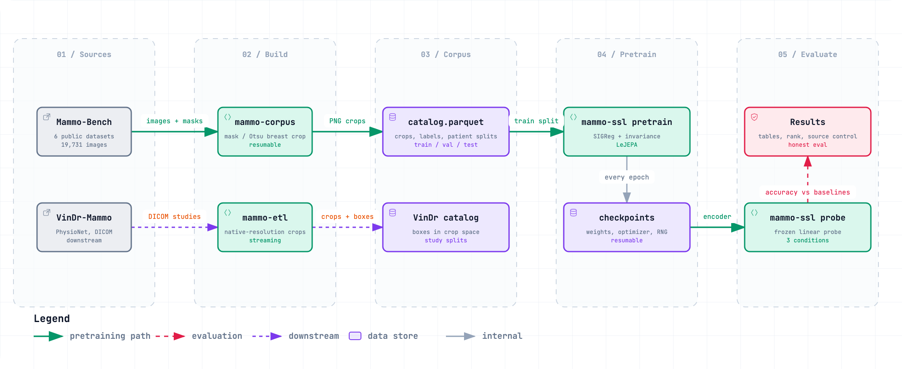
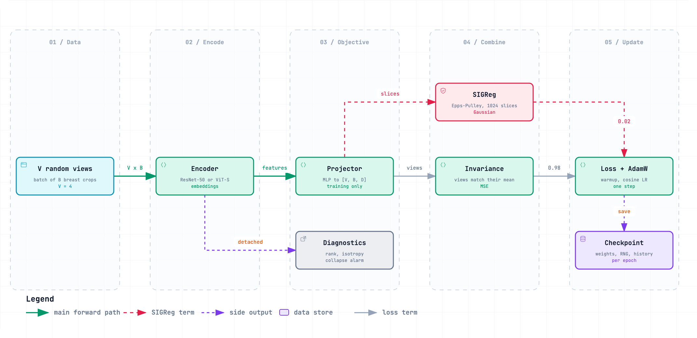
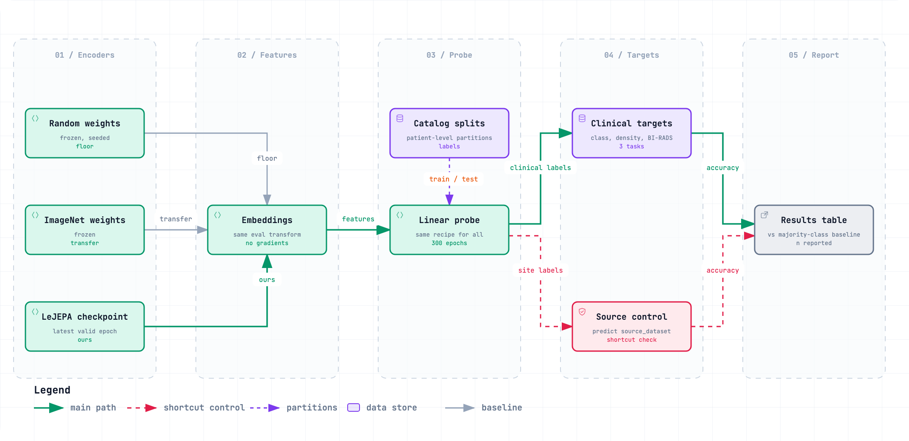

# mammo-lejepa

Self-supervised pretraining for mammography encoders using **LeJEPA**, with a
reproducible data pipeline and an evaluation protocol designed to distinguish
genuine representation learning from dataset-specific shortcuts.

The repository covers the full workflow:

1. **Build a mammography corpus** from Mammo-Bench: breast-region PNG crops,
   clinical labels, quality-control metadata, and patient-level train/validation/test
   splits.
2. **Pretrain an encoder** using the LeJEPA self-supervised objective, without
   labels, a teacher network, stop-gradient, or a momentum encoder.
3. **Evaluate representations consistently** against random initialization and
   ImageNet-pretrained baselines under an identical linear-probe protocol.
4. **Prepare VinDr-Mammo** as a separate downstream dataset with native-resolution
   breast crops and finding boxes remapped into crop coordinates.

> [!WARNING]
> **Research status:** the corpus pipeline and VinDr-Mammo ETL have been verified
> on real data. The LeJEPA training and evaluation implementation has been tested
> and smoke-tested with a 3-epoch real-data run.  
>
> **No full-length pretraining experiment has been evaluated yet.** This repository
> does not currently claim that LeJEPA outperforms the included baselines. See
> [Project status](#project-status).

## Overview



Each pipeline stage maps to one command-line entry point:

| Command | Responsibility |
|---|---|
| `mammo-corpus` | Build, inspect, validate, and split the Mammo-Bench corpus |
| `mammo-ssl` | Pretrain encoders and evaluate learned representations |
| `mammo-etl` | Prepare VinDr-Mammo as a downstream dataset |

Interactive versions of the diagrams are available in [`docs/`](docs/):

- [`pipeline.html`](docs/pipeline.html)
- [`training-step.html`](docs/training-step.html)
- [`evaluation.html`](docs/evaluation.html)

## Why LeJEPA?

Many self-supervised learning methods prevent representation collapse through a
combination of heuristics: momentum teachers, stop-gradient operations, predictor
heads, and carefully tuned schedules.

LeJEPA uses a different approach. It regularizes projected embeddings so that their
distribution approaches an isotropic Gaussian. A collapsed representation cannot
match that distribution, while the remaining objective encourages invariance across
augmented views of the same mammogram.

```text
loss = λ · SIGReg(projections) + (1 - λ) · invariance(projections)
```

The objective contains two terms:

- **SIGReg** projects embeddings along many random one-dimensional directions and
  compares their distribution with a standard Gaussian using the Epps-Pulley
  statistic. Projection directions are redrawn at every call, preventing the model
  from adapting to a fixed set of slices.
- **Invariance** brings the embeddings of `V` augmented views of the same image
  toward their mean representation.

Default configuration:

| Parameter | Default |
|---|---:|
| `lambda` | `0.02` |
| Views per image | `4` |
| Random slices | `1024` |
| Quadrature nodes | `17` |

LeJEPA is appealing for mammography because labels are limited, images are large
and highly structured, and a label-free collapse diagnostic is valuable during
pretraining.

The implementation was validated against the official `lejepa` package:

- The core statistic matches bit-for-bit.
- Full-pipeline outputs match within expected sampling noise.
- The official package is used only as a development dependency for validation;
  training code does not import it.

### Training step



For each batch:

1. Each breast crop is transformed into `V` random augmented views.
2. The encoder produces image embeddings.
3. A projector maps embeddings into a tensor of shape `[V, B, D]`.
4. LeJEPA computes the invariance and SIGReg terms on projected embeddings.
5. Detached encoder embeddings are passed to diagnostics that track effective rank,
   spectral entropy, and isotropy deviation.
6. If effective rank drops below a configured threshold, training emits a collapse
   warning before the issue appears in downstream metrics.

At the end of every epoch, the trainer saves a checkpoint containing:

- Model weights
- Optimizer state
- Training configuration
- Training history
- Python, NumPy, and PyTorch RNG states

## Evaluation protocol



A linear-probe score alone is not enough to establish useful representation
learning. This project uses a controlled protocol intended to make results
interpretable.

### Compared conditions

Every target is evaluated with the same split, transformations, probe architecture,
optimization recipe, and seed.

| Condition | Purpose |
|---|---|
| Random frozen encoder | Lower-bound reference: how well can the probe perform without learned visual features? |
| ImageNet frozen encoder | Transfer-learning baseline: does in-domain pretraining improve on generic natural-image features? |
| LeJEPA checkpoint | Representation learned from mammography images without labels |

### Evaluation safeguards

- **Patient-level splits:** partitions are derived from the corpus catalog and are
  never re-sampled during evaluation.
- **No patient leakage:** a patient cannot appear in more than one split.
- **Complete metric reporting:** each result reports accuracy, balanced accuracy,
  majority-class baseline, and sample count.
- **Per-source metrics:** performance is broken down by `source_dataset`.
- **Source-identification control:** an additional probe predicts the source dataset
  rather than a clinical label. Near-perfect source accuracy indicates that clinical
  metrics may partly rely on dataset-specific shortcuts.
- **Negative results are retained:** failed or non-improving experiments are written
  up under the same protocol as successful ones.

Available probe targets:

- `classification`
- `density`
- `BIRADS`
- `source_dataset` control task

Clinical targets are evaluated only on catalog rows that contain the corresponding
label.

## Data sources and licensing

Mammo-Bench aggregates six public mammography datasets. Each source has its own
license, access conditions, and redistribution restrictions.

> [!IMPORTANT]
> The table below is informational only. Before using, redistributing, or publishing
> results based on any source dataset, review the current terms of the original
> provider. Dataset licensing can change over time.

| Source | Images | Patients |
|---|---:|---:|
| DDSM | 10,400 | 2,280 |
| CMMD | 5,202 | 1,856 |
| KAU-BCMD | 2,206 | 478 |
| CDD-CESM | 1,003 | 326 |
| DMID | 510 | 510 |
| INbreast | 410 | 410 |
| **Total** | **19,731** | **5,860** |

Any publication using this corpus should cite Mammo-Bench and the six original
datasets.

### Clinical-data policy

Clinical images, derived PNG crops, Parquet catalogs, annotation CSVs, model
checkpoints, and experiment outputs are **not redistributed** by this repository.

The following paths are intentionally excluded from version control:

```text
data/
runs/
checkpoints/
.env
```

Do not upload patient data, image derivatives, annotations, or credentials to
public repositories or third-party services without confirming that the relevant
terms and institutional requirements permit it.

## Requirements and installation

Requirements:

- Python 3.12 or later
- [`uv`](https://docs.astral.sh/uv/)

Install project dependencies:

```bash
uv sync
```

### Expected Mammo-Bench layout

Mammo-Bench is expected to be available locally. No credentials are required by the
pipeline itself.

```text
data/
└── Mammo_Bench_v2/
    ├── CSV_Files/
    │   └── mammo-bench.csv
    ├── <source>/
    │   ├── Preprocessed_Dataset/
    │   ├── Masks/
    │   └── Original_Dataset/
    └── ...
```

The exact expected structure is documented in
[`specs/002-mammobench-corpus/quickstart.md`](specs/002-mammobench-corpus/quickstart.md).

## Build the Mammo-Bench corpus

Use `mammo-corpus` to build breast crops, inspect results, generate quality reports,
consolidate metadata, and create patient-level splits.

```bash
# Build a small sample from a single source.
uv run mammo-corpus build --source inbreast --limit 8

# Inspect crops before processing the full corpus.
uv run mammo-corpus inspect --source inbreast --n 8

# Build the full corpus.
uv run mammo-corpus build --workers 8

# Generate quality-control reports.
uv run mammo-corpus qc

# Convert per-image records into the canonical catalog.
uv run mammo-corpus consolidate

# Create patient-level train/validation/test partitions.
uv run mammo-corpus split --seed 0 --ratios 0.8 0.1 0.1
```

### Corpus-building behavior

- **Resumable:** rerunning `build` resumes incomplete work and does not reprocess
  completed images.
- **Interruptible:** full-corpus runs can be stopped with `Ctrl-C`.
- **Mask-aware:** breast boxes use the provided mask when available.
- **Fallback segmentation:** if a usable mask is unavailable, bounding boxes are
  estimated with Otsu thresholding.
- **Traceable:** the source of each box is recorded in the catalog.
- **Conservative QC:** implausible crops are marked as `suspect`; they are not
  silently removed from the corpus.

A visual inspection step is strongly recommended before running the full corpus:

```bash
uv run mammo-corpus inspect --source inbreast --n 8
```

See the full walkthrough in
[`specs/002-mammobench-corpus/quickstart.md`](specs/002-mammobench-corpus/quickstart.md).

## Pretrain an encoder

Use `mammo-ssl pretrain` to train a ResNet-50 encoder with LeJEPA.

```bash
# Train a ResNet-50 on the full configured corpus.
uv run mammo-ssl pretrain --epochs 100 --batch-size 256

# Restrict training to selected data sources.
uv run mammo-ssl pretrain --source ddsm --source cmmd
```

A new run is created under:

```text
runs/run_<id>/
```

### Training behavior

- **Checkpointing:** `Ctrl-C` and `SIGTERM` trigger checkpoint saving before exit.
- **Resume support:** provide the original run directory through `--run-dir`; no
  separate resume flag is required.
- **Automatic device selection:** CUDA, Apple MPS, or CPU is selected automatically.
  Use `--device` to override the selection.
- **Mixed precision:** CUDA uses `bfloat16` through the same training code path.
- **Reproducibility:** CPU resume runs reproduce uninterrupted CPU runs bit-for-bit.
  Apple MPS is not expected to be bit-reproducible against CPU.
- **Experiment traceability:** each run stores the seed, `config.json`,
  `history.jsonl`, checkpoints, and RNG states.

A Vision Transformer small variant (`ViT-S`) is planned but not yet implemented.

## Evaluate a pretrained run

Use `mammo-ssl` to run linear probes, diagnose representation geometry, and compare
experiments.

```bash
# Run random, ImageNet, and LeJEPA probes, including the source-control task.
uv run mammo-ssl probe --run-dir runs/<run_id>

# Faster smoke-test evaluation.
uv run mammo-ssl probe \
  --run-dir runs/<run_id> \
  --max-samples 300 \
  --no-imagenet

# Compute rank and isotropy diagnostics by epoch and on the test split.
uv run mammo-ssl diagnose --run-dir runs/<run_id>

# Compare two experiment directories.
uv run mammo-ssl compare \
  --run-dir runs/a \
  --run-dir runs/b
```

The probe command writes:

```text
runs/<run_id>/eval/
├── results.json
├── results.md
├── config.json
└── <evaluated checkpoint metadata>
```

> [!NOTE]
> The ImageNet baseline downloads pretrained weights the first time it is used.

## Prepare VinDr-Mammo

`mammo-etl` streams VinDr-Mammo from PhysioNet and prepares it as a separate
downstream evaluation dataset.

For each DICOM image, the pipeline:

1. Finds the breast region.
2. Crops the image at native resolution.
3. Preserves native pixel dimensions during dataset construction.
4. Remaps finding bounding boxes into crop coordinates.
5. Uses VinDr-Mammo's official study-level split.

```bash
# Validate the environment without downloading data.
uv run mammo-etl doctor

# Process a bounded sample from the training split.
uv run mammo-etl run --split training --n-studies 5

# Resume the latest interrupted ETL run.
uv run mammo-etl resume

# Retry only failed images.
uv run mammo-etl retry
```

VinDr-Mammo requires PhysioNet credentials in a git-ignored `.env` file. The
`doctor` command distinguishes expired session cookies from missing annotation CSVs.

For setup and operational details, see
[`specs/004-vindr-downstream/quickstart.md`](specs/004-vindr-downstream/quickstart.md).

## Catalog schema

### `catalog.parquet`

The canonical corpus catalog contains one row per image.

| Group | Fields |
|---|---|
| Identity | `image_id`, `source_dataset`, `source_subject_id`, `patient_key`, `laterality`, `view` |
| Outcome | `status`, `failure_category`, `error_message`, `crop_path`, `crop_bytes` |
| Geometry | `image_height`, `image_width`, `crop_x0`, `crop_y0`, `crop_x1`, `crop_y1`, `crop_height`, `crop_width`, `crop_margin_px`, `crop_area_ratio` |
| Quality | `box_source`, `fallback_reason`, `threshold`, `mask_area_ratio`, `mask_otsu_iou`, `suspect`, `suspect_reason` |
| Labels | `classification`, `density`, `birads`, `abnormality`, `molecular_subtype`, `subject_age` |
| Provenance | `run_id`, `code_version`, `processed_at`, `process_seconds` |
| Partition | `split` |

Important field values:

```text
status:
  ok | failed

box_source:
  MASK | OTSU

split:
  train | val | test
```

The uniqueness key is `image_id`.

A row is marked `suspect` when its crop area, aspect ratio, or mask/Otsu overlap is
implausible. Suspect rows remain in the catalog and are not filtered automatically.
Whether they are included in training is a deliberate experiment configuration
choice:

```text
--include-suspect
--no-include-suspect
```

### `splits.parquet`

`split.parquet` contains one row per `(patient_key, split)` pair:

```text
patient_key
source_dataset
split
n_images
seed
```

The partition unit is always the patient:

```text
patient_key = source_dataset + source_subject_id
```

Therefore, no patient may appear across multiple partitions.

When a patient has images with more than one `classification`, splitting uses the
most severe available class:

```text
Malignant
> Suspicious Malignant
> Benign
> Normal
```

### Quality-control outputs

`mammo-corpus qc` generates:

```text
quality_by_source.parquet
qc/quality_report.md
```

These outputs include:

- Per-source percentiles for `crop_area_ratio`
- Per-source percentiles for `mask_otsu_iou`
- Otsu fallback counts
- Suspect-case paths and reasons

## Known data-quality notes

### `cdd-cesm`

Images are already tightly cropped to breast tissue by the original provider.
Consequently, `crop_area_ratio` is close to `1.0` across the source and may trigger
the area-based suspect heuristic.

This is expected behavior rather than evidence of a crop failure. See
`D-01` and `D-07` in
[`specs/002-mammobench-corpus/research.md`](specs/002-mammobench-corpus/research.md).

### `ddsm`

Masks and source images rarely share the same native resolution. Before bounding-box
calculation, masks are realigned to the image using nearest-neighbor interpolation.

See `D-07` in
[`specs/002-mammobench-corpus/research.md`](specs/002-mammobench-corpus/research.md).

### `kau-bcmd`

Manual inspection found that masks are systematically narrower than visible breast
tissue in some samples. Review `mask_area_ratio` and suspect cases in the full
quality report before using this source in a production experiment.

## Project layout

```text
src/mammo_lejepa/
├── geometry.py
├── segmentation.py
├── boxing.py
├── quality.py
├── splits.py
│   └── Pure corpus logic
├── image_io.py
├── storage.py
├── catalog.py
├── manifest.py
├── resume.py
│   └── I/O and persistence
├── runner.py
├── worker.py
├── cli.py
│   └── mammo-corpus CLI
├── ssl/
│   ├── objective.py
│   ├── diagnostics.py
│   ├── schedules.py
│   ├── augment.py
│   │   └── Losses, metrics, schedules, and views
│   ├── encoders.py
│   ├── projector.py
│   ├── data.py
│   ├── checkpoint.py
│   ├── trainer.py
│   │   └── Models, data loading, checkpointing, and training
│   ├── probe.py
│   ├── baselines.py
│   ├── reporting.py
│   └── cli.py
│       └── Evaluation and CLI
└── vindr/
    └── VinDr-Mammo ETL

specs/
└── Specification artifacts: specs, plans, research, contracts, and tasks

docs/
└── Interactive HTML diagrams and PNG exports

tests/
└── Mirrors src/, including tests/ssl and tests/vindr
```

The codebase follows a strict separation between pure logic and I/O:

- **Pure modules** implement geometry, objectives, diagnostics, and schedules
  without touching the filesystem, network, or system clock.
- **I/O modules** handle files, persistence, downloads, and process orchestration.
- Pure logic is unit-tested in isolation.

This design follows the project constitution in
[`.specify/memory/constitution.md`](.specify/memory/constitution.md), whose core
principles are reproducibility, bounded and resumable execution, traceability, and
honest evaluation.

## Tests

The test suite does not require real clinical data or a GPU.

```bash
# Run the full suite.
uv run pytest

# Run SSL pretraining and evaluation tests.
uv run pytest tests/ssl -q

# Skip tests that train small models.
uv run pytest -m "not slow"
```

## Project status

| Feature | Description | Status |
|---|---|---|
| `001` | Original VinDr streaming ETL | Superseded by `004` |
| `002` | Mammo-Bench corpus pipeline | Complete and verified on real data |
| `003` | LeJEPA pretraining and evaluation | Phases 1–4 implemented; critical review of a real full run pending |
| `004` | VinDr-Mammo downstream pipeline | Complete and verified on 3 real studies |

### Remaining work

The main remaining items are:

- Run a full-length LeJEPA pretraining experiment.
- Write the experiment analysis in `runs/<run_id>/findings.md`.
- Implement the ViT-S encoder and an architecture-agnostic test suite.
- Run a DDSM ablation study.
- Integrate VinDr-Mammo into the probe workflow, which is currently out of scope.

Each feature is documented under:

```text
specs/<nnn>-<name>/
```

Typical artifacts include:

```text
spec.md
plan.md
research.md
data-model.md
contracts/
quickstart.md
tasks.md
```

## Contributing

Contributions should preserve the project’s core requirements:

- No patient leakage across data partitions.
- Reproducible experiments and explicit configuration capture.
- Bounded, resumable processing for long-running jobs.
- No silent filtering or deletion of clinically relevant records.
- Baselines and negative results reported alongside positive results.
- No redistribution of restricted medical images, labels, derivatives, or credentials.
